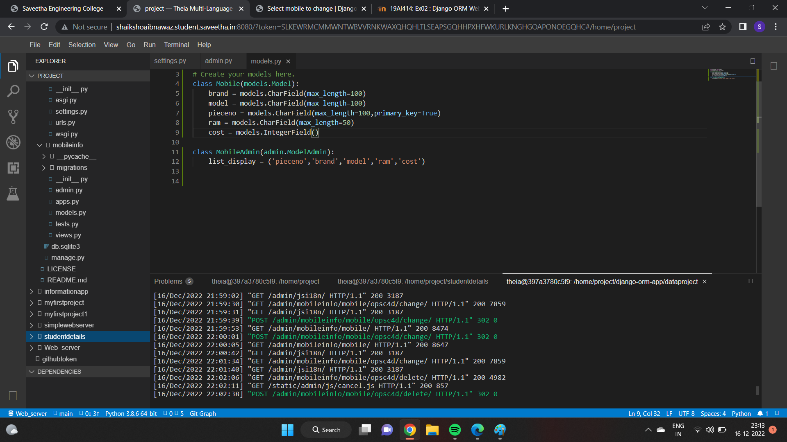
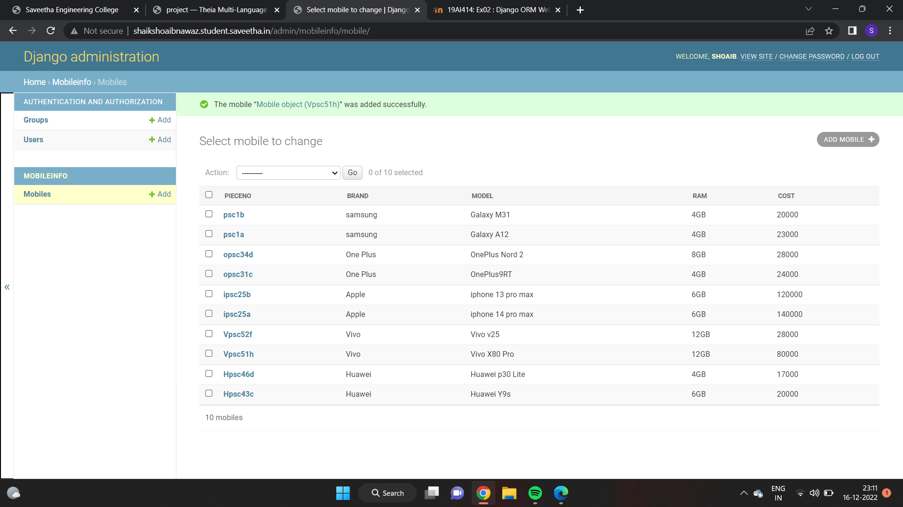

# Django ORM Web Application

## AIM:
To develop a Django application to store and retrieve data from a database using Object Relational Mapping(ORM).

## Entity Relationship Diagram:


## DESIGN STEPS:

### STEP 1:
After cloning repository from github go into the file using command "cd django-orm-app" and then go into your project file using "cd dataproject"then creat app called mobileinfo using command "python3 manage.py startapp mobileinfo" this will add your app inside your project which is dataproject.

### STEP 2:
Now add changes with Allowed Host and Installed apps in setting.py and then save changes using ctrl+s,go into models.py in mobileinfo app and write your python code to display contents and save it using ctrl+s

### STEP 3:
Then go into admin.py in mobileinfo app and write where to display your models in the Django admin panel.After this write a command "python3 manage.py makemigrations"it packs up your model changes into individual migration files .So after executing migrate all the tables of your installed apps are created in your database file.Now run server by using "python3 manage.py runserver 0:80"

## PROGRAM:
```
from django.db import models
from django.contrib import admin
# Create your models here.
class Mobile(models.Model):
    brand = models.CharField(max_length=100)
    model = models.CharField(max_length=100)
    pieceno = models.CharField(max_length=100,primary_key=True)
    ram = models.CharField(max_length=50)
    cost = models.IntegerField()

class MobileAdmin(admin.ModelAdmin):
    list_display = ('pieceno','brand','model','ram','cost')

```

## OUTPUT:
### Server side output:


### Client Side Output:



## RESULT:
The program is executed succesfully
